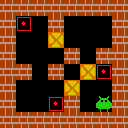
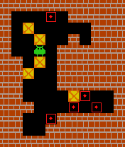
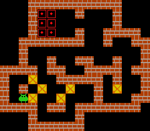

# AlphaZero Inspired RL Agent for Sokoban Planning

This project was carried out by a group of 7 students as part [Advanced Project Course (AI and Machine Learning)](https://studieinfo.liu.se/en/kurs/TDDE19/ht-2024#syllabus) during my masters programme in Linköping university.
 

## Abstract
This project explores the use of the AlphaZero reinforcement learning algorithm to solve Sokoban, a PSPACE-complete puzzle game. The approach leverages a combination of Monte Carlo Tree Search (MCTS) and a neural network. The implementation includes optimizations to MCTS such as cycle detection and softlock prevention to improve efficiency. While the results demonstrate that the approach can solve smaller boards, the trained models struggled with medium and complex boards, failing to outperform state-of-the-art solvers.

## Agent Solving Visualizations

The following GIFs demonstrate the agent solving Sokoban puzzles at varying difficulty levels, illustrating its capabilities and challenges:

### Easy Level

### Medium Level

### Hard Level

## Code & Data
All code and data are proprietary. For inquiries about access or further questions, please contact me via [email](gupta.priyansh918@gmail.com), or [Linkedin](https://www.linkedin.com/in/pggupta/)."
